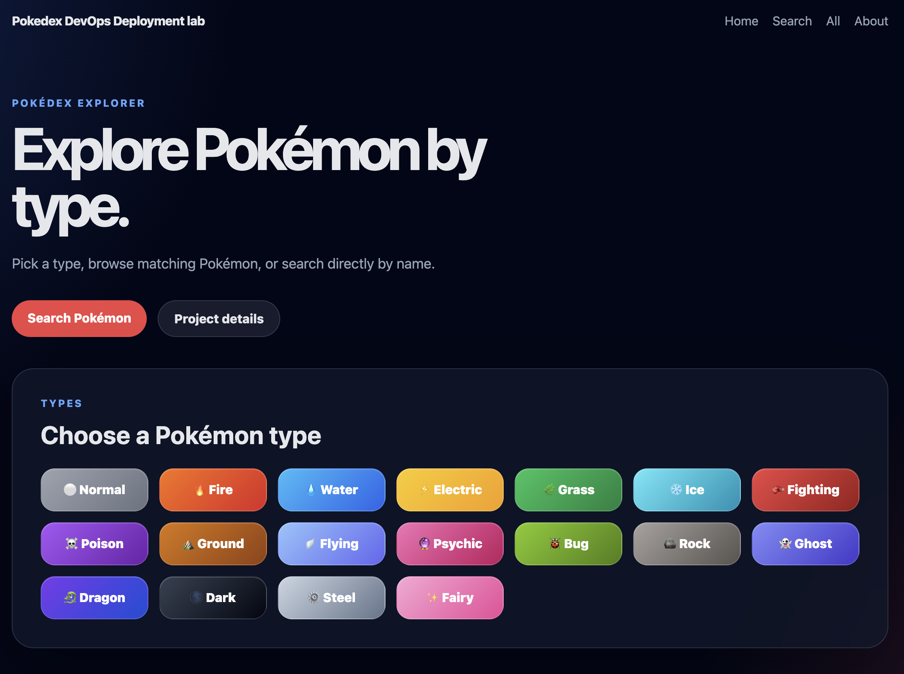
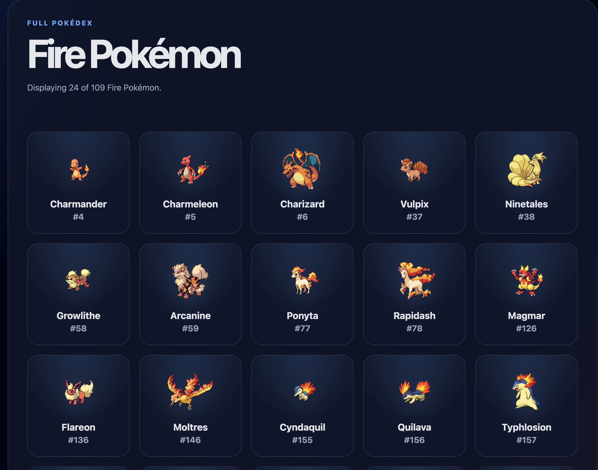
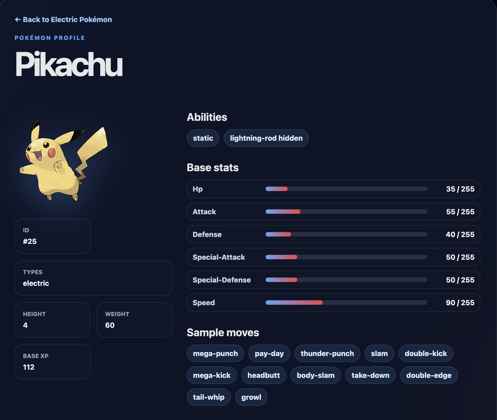

# Pokedex DevOps Deployment Lab


A small Node.js Pokédex application used to learn and demonstrate a complete DevOps deployment workflow: application development, Docker packaging, Terraform infrastructure, Ansible deployment through AWS Systems Manager, DNS and HTTPS.

Final public architecture:

```text
User
→ https://pokedex.badiscloud.fr
→ OVH DNS
→ AWS Elastic IP
→ EC2
→ Caddy Docker container
→ Docker network
→ Node.js Express app container
→ PokéAPI
```

---

## Screenshots

> Screenshots of the deployed application.







---

## Project goals

This project was built as a practical DevOps learning lab.

It demonstrates:

- Node.js and Express
- EJS templates and partials
- frontend JavaScript and DOM rendering
- API consumption from PokéAPI
- Jest and Supertest testing
- ESLint code quality
- Docker application packaging
- Terraform AWS infrastructure
- Ansible deployment through SSM
- EC2 administration without SSH
- Caddy reverse proxy
- HTTPS with Let’s Encrypt
- OVH DNS
- cost-aware infrastructure lifecycle
- GitHub Actions CI

---

## Application overview

The app provides:

- home page
- Pokémon search
- all Pokémon listing
- Pokémon by type
- Pokémon detail page
- custom 404 page

The backend exposes:

```text
GET /health
GET /api/pokemon
GET /api/pokemon/type/:type
GET /api/pokemon/:name
```

The frontend calls the backend, not PokéAPI directly.

---

## Infrastructure overview

Terraform creates:

- VPC
- public subnet
- internet gateway
- route table
- security group
- IAM role and instance profile for SSM
- S3 transfer bucket for Ansible SSM
- EC2 instance
- Elastic IP association

No SSH access is exposed.

Security group allows:

```text
80/tcp
443/tcp
```

Admin access is through AWS Systems Manager.

---

## Deployment overview

Ansible runs from a Dockerized control node.

It deploys through SSM:

```text
Dockerized Ansible
→ AWS SSM
→ EC2
```

The playbook:

1. installs Docker
2. copies a clean app bundle
3. builds the Docker image on EC2
4. creates a Docker network
5. runs the Node.js application container
6. runs the Caddy reverse proxy container
7. verifies the health endpoint

---

## Security and operations choices

- No SSH access is exposed on the EC2 instance.
- Administration is done through AWS Systems Manager.
- The Node.js container is not exposed directly to the Internet.
- Caddy is the only public entrypoint on ports 80 and 443.
- HTTPS is handled automatically with Let’s Encrypt.
- Terraform state and variable files are excluded from Git.
- AWS credentials are not stored in the repository.
- Infrastructure can be destroyed and recreated with Makefile commands.
- The Elastic IP is intentionally kept outside the normal destroy lifecycle to keep DNS stable.

---

## Repository structure

```text
.
├── app
│   ├── package.json
│   ├── public
│   ├── src
│   ├── tests
│   └── views
├── ansible
│   ├── ansible.cfg
│   ├── inventories
│   └── playbooks
├── docs
├── terraform
│   ├── environments
│   └── modules
├── tools
│   └── ansible
├── Dockerfile
├── .dockerignore
├── .gitignore
└── Makefile
```

---

## Local application commands

From `app/`:

```bash
npm ci
npm run check
npm start
```

Healthcheck:

```bash
curl http://localhost:3000/health
```

---

## Docker application image

From the repository root:

```bash
docker build -t pokedex-devops-deployment-lab:local .
docker run --rm -p 3000:3000 pokedex-devops-deployment-lab:local
```

---

## Main Makefile commands

```bash
make app-check
make app-build
make ansible-build
make tf-init
make tf-plan
make tf-apply
make tf-output
make ansible-inventory
make ansible-ping
make deploy
make health
make tf-destroy
```

Typical deployment workflow:

```bash
make tf-apply
make ansible-build
make ansible-ping
make deploy
make health
```

Cleanup:

```bash
make tf-destroy
```

---

## GitHub Actions CI

The CI pipeline runs on push and pull requests to `main`.

It validates:

- Node.js dependencies installation
- ESLint
- Jest tests
- application Docker image build
- Terraform formatting
- Terraform validation

The CI does not deploy infrastructure and does not require AWS credentials.

---

## Public URL

```text
https://pokedex.badiscloud.fr
```

Healthcheck:

```bash
curl https://pokedex.badiscloud.fr/health
```

---

## Important cost note

The EC2 infrastructure is destroyable with Terraform.

However, the Elastic IP was intentionally created outside the Terraform destroy lifecycle to keep DNS stable.

This Elastic IP can still generate a small monthly cost while it exists.

Release it manually only if the project is no longer needed.

---

## Documentation

Detailed documentation is available in:

```text
docs/01-application-code.md
docs/02-docker.md
docs/03-terraform-aws-infra.md
docs/04-ansible-ssm-deployment.md
docs/05-domain-https-caddy.md
docs/06-troubleshooting.md
docs/07-cost-and-cleanup.md
docs/08-full-rebuild-runbook.md
```

Recommended reading order:

```text
1. docs/08-full-rebuild-runbook.md
2. docs/03-terraform-aws-infra.md
3. docs/04-ansible-ssm-deployment.md
4. docs/05-domain-https-caddy.md
5. docs/06-troubleshooting.md
```

---

## Key lessons

This project shows how a small application can evolve into a complete DevOps workflow:

```text
Code
→ tests
→ Docker image
→ Terraform infrastructure
→ SSM-secured EC2
→ Ansible deployment
→ HTTPS reverse proxy
→ public domain
→ GitHub Actions CI
→ reproducible workflow
```
